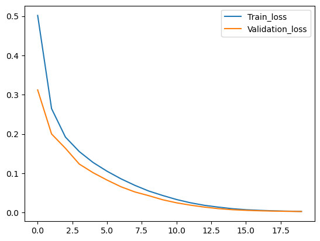
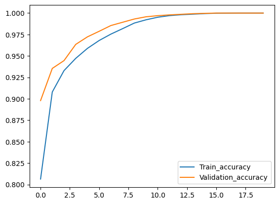

# IMDb Sentiment Analysis using Bidirectional LSTM

This project demonstrates sentiment analysis on the IMDb dataset using a bidirectional LSTM neural network implemented with TensorFlow. The goal is to predict whether a movie review is positive or negative based on its text.

## Dataset

The IMDb dataset consists of 50,000 movie reviews labeled as positive or negative. The dataset is split into 25,000 reviews for training and 25,000 for testing.

## Requirements

- Python 3
- TensorFlow 2.x
- Matplotlib

## Usage

1. Clone the repository:

    ```bash
    git clone https://github.com/your-username/your-repository.git
    ```

2. Install dependencies:

    ```bash
    pip install -r requirements.txt
    ```


## Model Architecture

The neural network model consists of the following layers:

1. Embedding layer: Maps each word to a dense vector representation.
2. Bidirectional LSTM layers: Captures contextual information from both directions.
3. Dense layer with sigmoid activation: Produces the final output (positive or negative sentiment).

## Training

The model is trained for 5 epochs with a batch size of 64. Adam optimizer and binary cross-entropy loss are used for training.

## Results





The above plots show the training and validation accuracy, as well as the training and validation loss, over the epochs.

## License

This project is licensed under the MIT License. See the [LICENSE](LICENSE) file for details.
